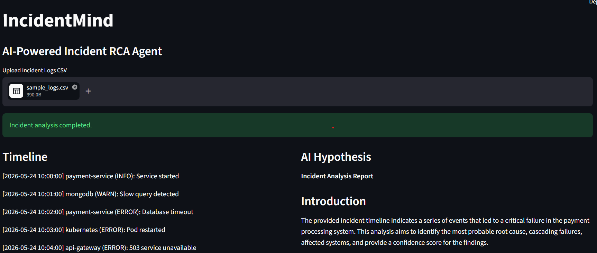
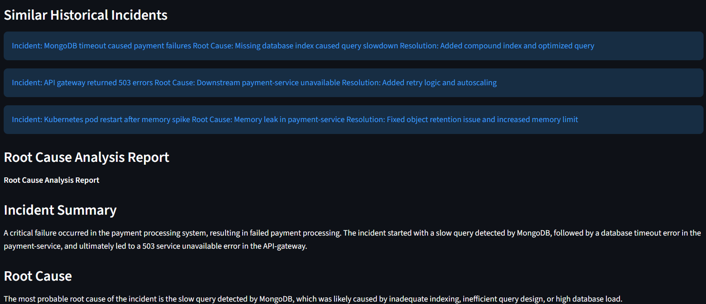

#  IncidentMind

AI-powered multi-agent incident root cause analysis platform built using LangGraph, RAG, FastAPI, ChromaDB, and Groq LLMs.

---
#  Screenshots


#  Features

- Multi-agent AI workflow orchestration using LangGraph
- Timeline reconstruction from production logs
- AI-powered root cause analysis
- Historical incident retrieval using RAG
- ChromaDB vector memory
- FastAPI backend APIs
- Streamlit frontend UI
- Groq Llama 3.3 integration
- Cascading failure reasoning

---

#  Architecture

Streamlit UI

↓
FastAPI Backend
↓
LangGraph Workflow
↓
AI Agents
├── Log Parser
├── Timeline Builder
├── Hypothesis Generator
├── RAG Retrieval Agent
└── RCA Writer
↓
Groq LLM + ChromaDB

---

#  Tech Stack

- Python
- FastAPI
- Streamlit
- LangChain
- LangGraph
- ChromaDB
- HuggingFace Embeddings
- Groq LLM
- Pandas

---

#  Workflow

1. Upload production incident logs
2. Build chronological incident timeline
3. Generate AI hypothesis
4. Retrieve similar historical incidents
5. Generate structured RCA report

---

#  Sample Output

- Timeline reconstruction
- Root cause identification
- Cascading failure analysis
- Resolution recommendations
- Prevention strategies

---

#  Future Improvements

- LangSmith tracing
- Kubernetes deployment
- Real-time observability integrations
- Slack/MS Teams integrations
- Multi-tenant memory support
- Grafana integrations

---

#  Run Locally

## Install dependencies

```bash
pip install -r requirements.txt